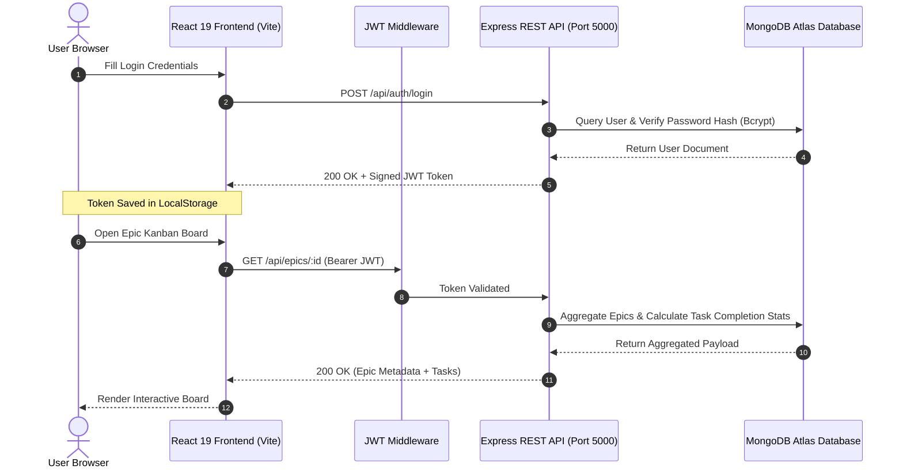

<div align="center">

```text
  _             _ _       ___ _               
 /_\   __ _ (_) | ___ | __| |_____ __ __
/ _ \ / _` || | |/ _ \| _| | / _ \ V  V /
/_/ \_\__, ||_|_|\___/|_|   |_\___/\_/\_/ 
       |___/                              
```

# ✨ AgileFlow — Enterprise Epics & Kanban Project Board

### *State-of-the-Art Agile Workspace with Real-Time Aggregations, Nested Epics, and Drag-and-Drop Kanban Boards*

> **🚀 Enterprise Features & Roadmap Complete (Checkpoint 4 Milestone Passed)**

<br />

[](https://react.dev/)
[](https://vite.dev/)
[](https://tailwindcss.com/)
[](https://expressjs.com/)
[](https://www.mongodb.com/)
[](https://jwt.io/)
[](LICENSE)

<br />

<p align="center">
  <a href="#-overview">Overview</a> •
  <a href="#-live-interface-preview">UI Preview</a> •
  <a href="#-key-highlights--capabilities">Key Features</a> •
  <a href="#-system-architecture">Architecture</a> •
  <a href="#-api-endpoint-reference">API Reference</a> •
  <a href="#-quick-start-guide">Quick Start</a> •
  <a href="#-environment-configuration">Environment Config</a>
</p>

<hr />

</div>

<br />

## 🌟 Overview

**AgileFlow** is a high-performance, full-stack agile project management workspace engineered to help software teams plan, coordinate, and execute tasks across custom product milestones (**Epics**).

Built on a decoupled **MERN stack** architecture, AgileFlow pairs a fluid, state-of-the-art **React 19 & Tailwind CSS v4** frontend powered by Vite with a secure, highly responsive **Node.js, Express, & MongoDB Atlas** REST API backend. AgileFlow features drag-and-drop workflows (`To Do`, `In Progress`, `Done`), real-time DB aggregation pipelines for progress counters, customizable epic color themes, task priority badges, and JWT-authenticated workspace isolation.

<br />

---

## 📸 Live Interface Preview

<div align="center">

| Kanban Board Workspace | Dashboard & Epic Overview |
| :---: | :---: |
| *Fluid Drag-and-Drop Column Board with Priority Markers & Progress Trackers* | *Epic Management Grid with Real-Time Task Aggregation Counters* |

</div>

<br />

---

## ⚡ Key Highlights & Capabilities

### 🔒 Enterprise Security & Robust Integrity
- **HTTP Security Headers (Helmet.js)**: Enforces Content Security Policy, HSTS, frameguard, and XSS headers.
- **Payload Limits & Input Sanitization**: Limits request body size (2MB) and sanitizes NoSQL injection attacks using `express-mongo-sanitize`.
- **Bulk Operation Ownership Verification**: Protects bulk update/delete endpoints against IDOR vulnerabilities by verifying task-to-epic ownership.
- **Salt-Factor 12 Password Hashing & In-App Password Change**: Uses `bcryptjs` cryptography with a secure password change endpoint and UI.
- **Signed JSON Web Token (JWT)**: Secures API endpoints with bearer authorization headers.

---

### 📊 Real-Time Epic Aggregations, Statuses & Analytics
- **Epic Status Lifecycle**: Manage epics with `Active`, `On-Hold`, `Completed`, and `Archived` states and dedicated Dashboard views.
- **MongoDB Pipeline Aggregations**: Executes aggregate queries (`$lookup`, `$group`, `$project`) to compute total and completed task metrics in a single database pass.
- **Dynamic Progress Meters & Workspace Analytics**: Real-time velocity tracker and progress meters per Epic.

---

### 📋 Advanced Kanban Engine, Sorting & Audit Logs
- **Preserved DnD Interactions**: Powered by `@hello-pangea/dnd` for smooth, cross-column card movement (`To Do`, `In Progress`, `Done`).
- **Flexible Task Sorting & Filtering**: Sort tasks by Drag Order, Priority, Due Date, Creation Date, or Title A–Z with ascending/descending toggles.
- **Task Activity & Audit Trail**: Immutable history log tracking task creation, status changes, priority edits, and assignee updates.
- **3-Tier Due Date System & Overdue Badges**: Color-coded deadline indicators (green/amber/red) with prominent Overdue pills on cards.
- **Task Pagination & Lazy Loading**: Efficient pagination (`limit`/`skip`) with a "Load More Tasks" interface for large boards.
- **Global Keyboard Shortcuts**: Quick actions (`E` = new epic, `N` = new task, `/` = search, `?` = shortcuts modal, `Esc` = cancel).

### 🚀 Complete Jira Software Alternatives & Transformation Engine
- **Atomic Project Key Generator**: Automated sequence numbering generating custom keys like `AGILE-101`.
- **Sprint Lifecycles & Backlog Planning**: Plan, start, and close sprints (`draft` -> `active` -> `closed`) with automated carryover of incomplete tasks to the backlog.
- **JQL Search & Saved Filters Engine**: Powerful Jira Query Language engine parsing queries like `type = bug AND status = "in-progress"`.
- **Sprint Burndown, Velocity & CFD Reports**: Executive reporting suite calculating burn rates, team velocity, and cumulative flow charts.
- **Time Tracking, Worklogs & Issue Links**: Track hours logged, log notes, and establish dependencies like `blocks` or `duplicates`.
- **In-App Notification Center & Activity Feed**: Real-time notifications for task assignments, comment mentions (`@user`), and project status changes.
- **Automation Rules Engine**: Automatically transition parent tasks to `Done` when all subtasks are finished.
- **Docker & Docker Compose**: Instantly spin up database and API server containers in development or production.
- **Production Build Bundle Splitting**: Optimized manual chunk splitting in Vite to guarantee high performance and fast loads.

<br />
- **React ErrorBoundary**: Global component error catching with graceful fallback UI and quick reload capabilities.
- **Toast Feedback System**: Real-time action alerts powered by `react-hot-toast` with styled dark themes.
- **Glassmorphic UI Controls**: Backdrop blurs, subtle borders, hover scale effects, and custom scrollbars built with Tailwind CSS v4.

<br />

---

## 🏗️ System Architecture

### 🌐 End-to-End Data & Security Flow



---

### 📂 Directory Structure

```text
AgileFlow/
├── server/                     # Express.js + Mongoose REST API Backend
│   ├── middleware/
│   │   └── auth.js             # JWT verification middleware guard
│   ├── models/
│   │   ├── User.js             # User model (Bcrypt hashing & password validation)
│   │   ├── Epic.js             # Epic container schema (User ownership ref)
│   │   └── Task.js             # Task schema (Epic ID ref, status, orderIndex)
│   ├── routes/
│   │   ├── auth.js             # Auth endpoints (/api/auth/register, /login)
│   │   ├── epics.js            # Epic CRUD & aggregate statistics endpoints
│   │   └── tasks.js            # Kanban Task CRUD & DnD order updates
│   ├── server.js               # Express server configuration & MongoDB bootstrapper
│   ├── .env.example            # Backend environment template
│   └── package.json            # Backend dependencies & dev scripts
│
├── src/                        # React 19 + Vite Frontend Client
│   ├── components/
│   │   ├── CreateEpicModal.jsx # Epic creation & editing modal wizard
│   │   ├── CreateTaskModal.jsx # Task creation & editing modal form
│   │   ├── ConfirmDialog.jsx   # Reusable delete confirmation modal
│   │   ├── KanbanBoard.jsx      # DnD column engine & card rendering
│   │   └── Navbar.jsx          # Top navigation header & user sign-out
│   ├── pages/
│   │   ├── BoardPage.jsx       # Interactive Epic Kanban workspace page
│   │   ├── DashboardPage.jsx   # Workspace Epics overview grid
│   │   ├── LoginPage.jsx       # Authentication login view
│   │   └── RegisterPage.jsx    # Member sign-up view
│   ├── api.js                  # Axios client instance with JWT request interceptor
│   ├── App.css                 # Custom scrollbars & glassmorphism utilities
│   ├── App.jsx                 # App routes & toast provider wrapper
│   ├── index.css               # Core Tailwind v4 imports & variables
│   └── main.jsx                # DOM root entry point
├── index.html                  # Main HTML template
├── package.json                # Frontend client dependencies & Vite scripts
└── vite.config.js              # Vite bundler configuration & proxies
```

<br />

---

## 🔌 API Endpoint Reference

### 🔐 Authentication (`/api/auth`)

| Method | Endpoint | Access | Request Body | Description |
| :--- | :--- | :--- | :--- | :--- |
| `POST` | `/api/auth/register` | Public | `{ name, email, password }` | Registers a new member account and returns a signed JWT. |
| `POST` | `/api/auth/login` | Public | `{ email, password }` | Authenticates credentials and returns a signed JWT token. |

---

### 📊 Epics Management (`/api/epics`)

*All requests require `Authorization: Bearer <token>` header.*

| Method | Endpoint | Request Body | Description |
| :--- | :--- | :--- | :--- |
| `GET` | `/api/epics` | *None* | Fetches all Epics owned by the user with computed task counts. |
| `POST` | `/api/epics` | `{ title, description, color }` | Creates a new Epic container. |
| `GET` | `/api/epics/:id` | *None* | Retrieves single Epic details and progress statistics. |
| `PUT` | `/api/epics/:id` | `{ title, description, color }` | Updates an existing Epic's title, description, or color tag. |
| `DELETE` | `/api/epics/:id` | *None* | Deletes an Epic and cascades deletion to all child tasks. |

---

### 📋 Task Kanban Engine (`/api/tasks`)

*All requests require `Authorization: Bearer <token>` header.*

| Method | Endpoint | Request Body | Description |
| :--- | :--- | :--- | :--- |
| `GET` | `/api/tasks?epicId=:id` | *None* | Retrieves all tasks for an Epic, sorted by column `orderIndex`. |
| `POST` | `/api/tasks` | `{ epicId, title, description, status, priority, assignee }` | Creates a new task card inside an Epic. |
| `PUT` | `/api/tasks/:id` | `{ status, orderIndex, title, priority, ... }` | Updates task status, DnD position, or content fields. |
| `DELETE` | `/api/tasks/:id` | *None* | Deletes a task card permanently. |

<br />

---

## ⚙️ Environment Configuration

### Backend Environment ([server/.env](file:///c:/Projects/AgileFlow/server/.env))

```env
# Server Listener Port
PORT=5000

# MongoDB Database Connection String
MONGODB_URI=mongodb://127.0.0.1:27017/agileflow

# JWT Token Cryptographic Secret & Duration
JWT_SECRET=your_super_secret_jwt_key_change_me_in_production
JWT_EXPIRES_IN=7d

# Allowed Frontend Origins (CORS)
CLIENT_ORIGIN=http://localhost:5173
```

### Frontend Environment ([.env](file:///c:/Projects/AgileFlow/.env))

```env
# Base URL pointing to Express REST API
VITE_API_BASE_URL=http://localhost:5000/api
```

<br />

---

## 🚀 Quick Start Guide

### Prerequisites
- **Node.js** (v18.0.0 or higher)
- **MongoDB** (Local instance running at `mongodb://127.0.0.1:27017` or a [MongoDB Atlas](https://www.mongodb.com/atlas) connection string)

---

### Step 1: Start Backend API Server

```bash
# 1. Navigate to the server folder
cd server

# 2. Copy sample environment file
cp .env.example .env

# 3. Install backend dependencies
npm install

# 4. Launch dev server (with nodemon hot reload)
npm run dev
```

> **Backend active at:** `http://localhost:5000`

---

### Step 2: Start Frontend Client

```bash
# 1. Open a new terminal and navigate to the project root
cd AgileFlow

# 2. Copy frontend environment template
cp .env.example .env

# 3. Install frontend dependencies
npm install

# 4. Start Vite development server
npm run dev
```

> **Frontend active at:** `http://localhost:5173`

<br />

---

## 🧪 Code Quality & Building

```bash
# Run oxlint for JavaScript/JSX static code analysis
npm run lint

# Build production bundle
npm run build

# Preview production build locally
npm run preview
```

<br />

---

## 🛠️ Tech Stack & Architecture Details

- **Frontend Core**: React 19, Vite, Tailwind CSS v4, Lucide React icons.
- **Backend Core**: Express.js, MongoDB Atlas (Mongoose), JWT security.
- **Project Structure**: Clean separation of routes, middleware, Mongoose models, and React pages/components.

<br />

---

## 📄 License

Distributed under the **MIT License**. See [`LICENSE`](LICENSE) for more details.

---

<div align="center">
  <sub>Built with ❤️ using React 19, Tailwind CSS v4, Express, and MongoDB.</sub>
</div>
